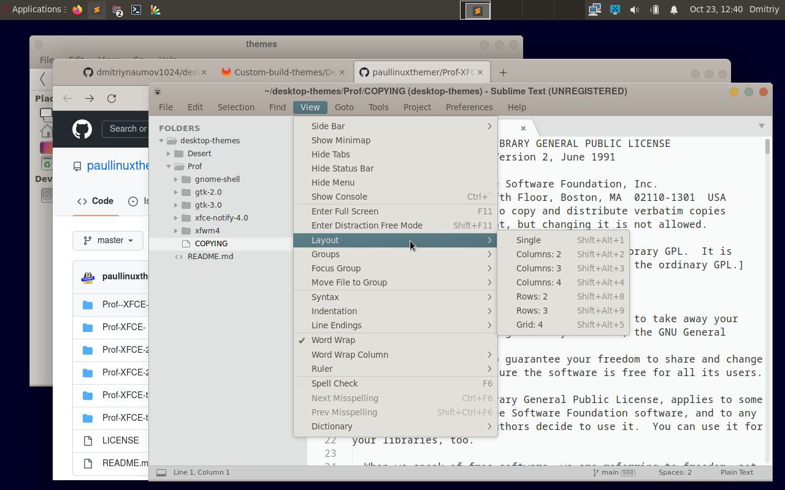
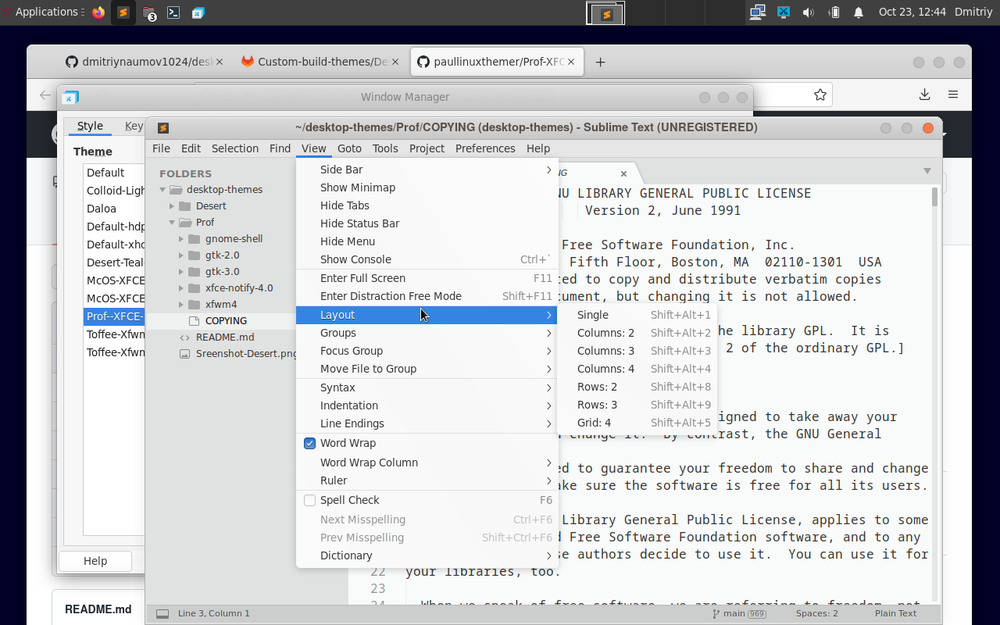

# desktop-themes

My fine selection of xfce-compatible themes (I did not make them, please check credit notes).
 
---

## Desert 

A nice theme by paullinux. [Gitlab link](https://gitlab.com/paullinux/gtk-theme-assembly-project/-/tree/master/Custom-build-themes/Desert-Teal-Blue-XFCE-1.3). Would be loved by those who like warm colors and MacOS buttons. My rating is 9/10. I modified it a little bit to remove frame & menu transparency and bloated text shadows. 

---

## Prof

Another good theme by paullinux. [Github link](https://github.com/paullinuxthemer/Prof-XFCE-theme). All smooth and nice, but checkboxes and some other UI elemets are not flat, so 9.5/10. 
